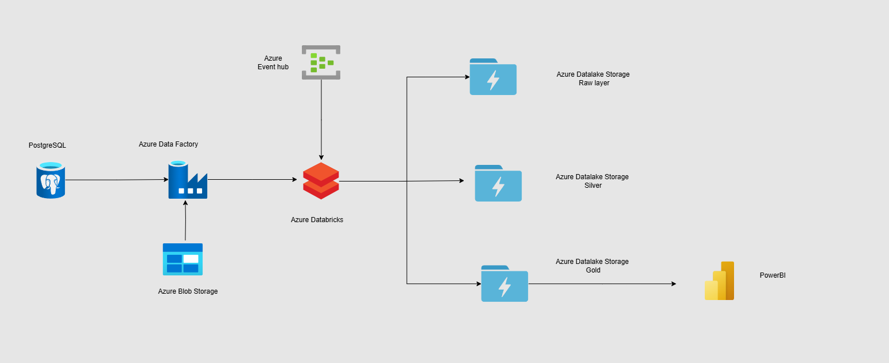

### **Healthcare Patient Records Pipeline – Azure Data Engineering**  

---

### **Goal of the Project:**  
Develop an end-to-end data pipeline to process and store healthcare patient records, including demographics, medical history, diagnoses, and prescriptions. The solution provides a scalable architecture for analytics and reporting, ensuring compliance with healthcare data standards.  

---

### **Flow of the Project:**  

1. **Data Source - PostgreSQL:**  
   - Patient records and healthcare data are ingested from a PostgreSQL database.  

2. **Data Ingestion - Azure Data Factory:**  
   - **Purpose:** Orchestrates the pipeline to fetch data from PostgreSQL.  
   - **Process:**  
     - Loads data into **Azure Blob Storage** as raw data for initial ingestion and archiving.  
     - Triggers workflows for further processing.  

3. **Event Streaming - Azure Event Hub :**  
   - Streams real-time updates such as appointment records, new admissions, or lab results for incremental data processing.  

4. **Data Processing - Azure Databricks:**  
   - **Purpose:** Applies transformations and cleansing using **PySpark**.  
   - **Steps:**  
     - Validates data for missing or erroneous values.  
     - Standardizes formats for compliance with healthcare standards (e.g., HL7, FHIR).  
     - Enriches data with lookup tables, such as ICD codes for diagnoses.  

5. **Data Storage - Azure Data Lake Storage Gen2:**  
   - **Raw Layer (Bronze):** Stores unprocessed/raw data from PostgreSQL.  
   - **Silver Layer:** Stores cleansed and validated data after basic transformations.  
   - **Gold Layer:** Stores enriched and structured data optimized for analytics and machine learning.  

6. **Data Analytics and Reporting:**  
   - Load **Gold Layer** data into Azure SQL Database or Power BI for dashboards and reporting.  

---

### **Services Used:**  

1. **Azure Data Factory:** Pipeline orchestration for data ingestion and automation.  
2. **Azure Blob Storage:** Temporary storage for raw data ingestion.  
3. **Azure Databricks:** Data processing and transformation using **PySpark**.  
4. **Azure Event Hub:** Real-time streaming for incremental data updates.  
5. **Azure Data Lake Storage Gen2:** Layered storage for raw, processed, and curated data.  
6. **Azure SQL Database/Power BI (Not shown):** Reporting and analytics.  

---

